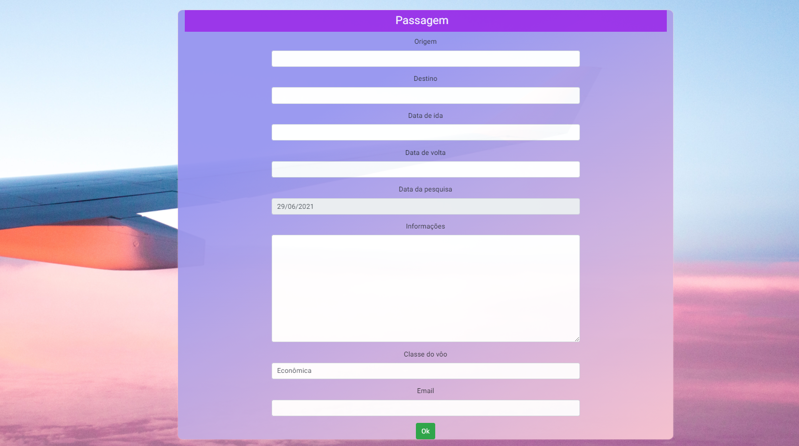

 <!-- Explicação do projeto -->
<h1 align="center">Formulários-django</h1>

	

 Desenvolvimento de um  formulário de Web App usando o framework Django 

 <!-- Status do projeto -->
<h4 align="center"> 
	 ✅ Formulários com Django  ✔ Finalizado ! ✅ 
</h4>

<!-- Indice -->

 <a href="#objetivo">Objetivo</a> •
 <a href="#roadmap">Roadmap</a> • 
 <a href="#tecnologias">Tecnologias</a> • 
 <a href="#contribuicao">Contribuição</a> • 
 <a href="#licenc-a">Licença</a> • 
 <a href="#autor">Autor</a>

<!-- Tecnologias envolvidas -->

	<h2 align="center"> 🛠 Tecnologias envolvidas</h2>
	<ul>
		<li><a href="https://www.python.org/"  target="_blank">Python</a></li>
		<li><a href="https://www.djangoproject.com/"  target="_blank">Django</a></li>                                   
	</ul>

<!-- Requirements -->

<h2 align="center"> Pré-requisitos </h2>
	
$ pip install requirements.txt

<!-- Resultados -->
<!-- Resultado forms -->

	<h2 align="center">>Resultado Forms</h2>

	

<!-- Resultado fticket -->

	<h2 align="center">>Resultado Ticket</h2>

	

   

